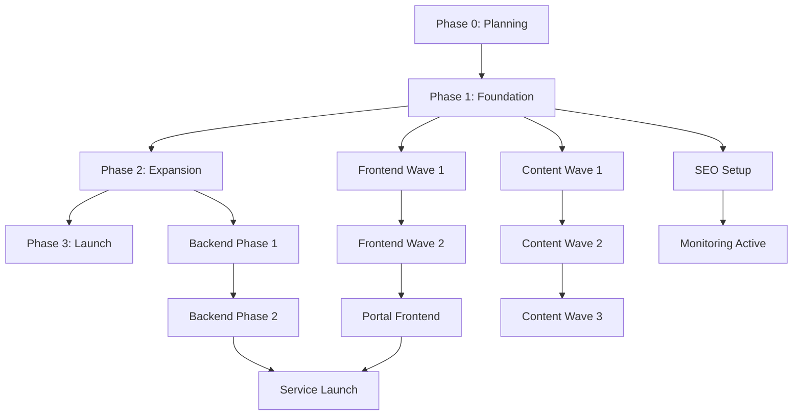

# Comprehensive Roadmap & Subdomain Content Strategy
## Aushnara College Digital Platform 2026

_Created: 2026-02-20 (UTC)_

---

## 🎯 Executive Summary

This roadmap consolidates all planning documents into a single execution blueprint covering:
- **16 subdomains** with detailed content strategies
- **27 active GitHub issues** organized into phased execution
- **4 workstreams**: Frontend, Backend, SEO, Content
- **12-week timeline** from planning lock to service launch

**Current Status**: Phase 0 (Planning Lock) — 90% complete  
**Next Milestone**: Phase 1 Foundation Launch (Week 2-4)

---

## 📋 Table of Contents

1. [Subdomain Strategy & Content Plans](#subdomain-strategy)
2. [Phased Execution Timeline](#timeline)
3. [Task Breakdown by Phase](#tasks)
4. [Workstream Dependencies](#dependencies)
5. [KPIs & Success Metrics](#kpis)

---

## 1. Subdomain Strategy & Content Plans {#subdomain-strategy}

### 🌐 Core Domain
**aushnaracollege.edu.bd** (Canonical Root)

**Purpose**: Primary institutional website  
**Content Strategy**:
- Homepage: Hero stats, admissions CTA, program overview
- About: History, leadership, facilities, achievements
- Programs: Hub page linking to undergraduate/diploma routes
- Admissions: Requirements, deadlines, fees, application process
- Contact: Multiple channels, department directory, map

**Priority**: ✅ Live and optimized (Wave 1 focus)

---

### 🔀 Redirect Hosts (Wave 1 Hardening)

#### **www.aushnaracollege.edu.bd**
- **Redirect**: → Root canonical
- **Status**: 301 active
- **Content**: Mirror of root
- **SEO Note**: Canonical pointing to apex domain

#### **admissions.aushnaracollege.edu.bd**
- **Current**: → `/admissions`
- **Future**: Promote to service host (Wave 2)
- **Content Plan**:
  - Online application portal
  - Document upload system
  - Application status tracking
  - Payment gateway integration
  - Admission test schedule

#### **apply.aushnaracollege.edu.bd**
- **Current**: → `/admissions`
- **Future**: Alias for admissions portal or separate quick-apply
- **Content Plan**:
  - Quick application form
  - Lightweight express interest capture
  - Redirect to full portal for completion

#### **undergraduate.aushnaracollege.edu.bd**
- **Redirect**: → `/undergraduate-programs`
- **Content Plan** (destination page):
  - Program catalog (Science, Commerce, Arts)
  - Course curriculum overview
  - Faculty highlights
  - Admission requirements
  - Career outcomes
  - Internal links to specific departments

#### **diploma.aushnaracollege.edu.bd**
- **Redirect**: → `/diploma-programs`
- **Content Plan** (destination page):
  - Diploma program list
  - Duration and fee structure
  - Eligibility criteria
  - Industry partnerships
  - Job placement statistics

#### **faculty.aushnaracollege.edu.bd**
- **Current**: → `/about`
- **Future**: Dedicated faculty directory (Wave 2)
- **Content Plan**:
  - Faculty profiles with photos
  - Qualifications and specializations
  - Research interests
  - Office hours and contact
  - Department-wise listings

#### **students.aushnaracollege.edu.bd**
- **Current**: → `/programs`
- **Future**: Student portal (Wave 2)
- **Content Plan**:
  - Student dashboard
  - Course schedule and attendance
  - Grades and transcripts
  - Fee payment
  - Library access
  - Notice board

#### **research.aushnaracollege.edu.bd**
- **Current**: → `/about`
- **Future**: Research showcase (Wave 3)
- **Content Plan**:
  - Research projects directory
  - Publications and papers
  - Research facilities
  - Collaboration opportunities
  - Student research program

#### **careers.aushnaracollege.edu.bd**
- **Current**: → `/contact`
- **Future**: Job portal (Wave 3)
- **Content Plan**:
  - Faculty positions
  - Administrative openings
  - Application process
  - Benefits and culture
  - Career development

#### **events.aushnaracollege.edu.bd**
- **Redirect**: → Mapped landing route
- **Content Plan** (destination):
  - Event calendar
  - Upcoming webinars and workshops
  - Cultural programs
  - Sports events
  - Registration links

#### **news.aushnaracollege.edu.bd**
- **Redirect**: → News section
- **Content Plan**:
  - Latest announcements
  - Achievement highlights
  - Press releases
  - Media coverage
  - Newsletter archive

#### **exam.aushnaracollege.edu.bd**
- **Redirect**: → Exam results section
- **Content Plan**:
  - Result lookup system
  - Exam schedule
  - Hall ticket download
  - Grading policy
  - Re-evaluation process

#### **alumni.aushnaracollege.edu.bd**
- **Current**: → Mapped route
- **Future**: Alumni portal (Wave 3)
- **Content Plan**:
  - Alumni directory
  - Success stories
  - Networking events
  - Donation portal
  - Alumni benefits

---

### 🔧 Service Hosts (Wave 2 Deployment)

#### **api.aushnaracollege.edu.bd**
- **Type**: Backend API Gateway
- **Stack**: Cloudflare Workers + Hono
- **Endpoints**:
  - `/v1/admissions/apply` — Application submission
  - `/v1/admissions/status` — Application tracking
  - `/v1/contact/submit` — Contact form
  - `/v1/contact/ticket` — Ticket creation
  - `/v1/results/search` — Exam result lookup
  - `/v1/auth/*` — Authentication (students/faculty)
- **Security**: Rate limiting, Turnstile, RBAC, audit logs
- **Documentation**: OpenAPI spec at `/docs`

#### **portal.aushnaracollege.edu.bd**
- **Type**: Unified portal frontend
- **Users**: Students, Faculty, Admissions team
- **Modules**:
  - **Student Dashboard**: Courses, grades, attendance, fees
  - **Faculty Dashboard**: Class management, grading, attendance
  - **Admissions Dashboard**: Application review, interview scheduling
  - **Admin Panel**: User management, system configuration
- **Auth**: SSO with role-based access
- **Mobile**: Responsive PWA

#### **library.aushnaracollege.edu.bd**
- **Status**: Reserved for future
- **Content Plan**:
  - Digital library catalog
  - E-book access (50,000+ titles)
  - Journal database
  - Book reservation system
  - Reading room booking

#### **docs.aushnaracollege.edu.bd**
- **Status**: Reserved for future
- **Content Plan**:
  - Institutional policies
  - Academic regulations
  - Forms and templates
  - Handbooks (student/faculty)
  - Compliance documents

#### **mail.aushnaracollege.edu.bd**
- **Status**: Reserved for future
- **Type**: Email service gateway
- **Content**: Redirect to institutional email (Google Workspace or similar)

---

### 🏢 Department Hosts (Future Wave)

All redirect to `/undergraduate-programs` until dedicated pages built:
- `engineering.aushnaracollege.edu.bd`
- `business.aushnaracollege.edu.bd`
- `medical.aushnaracollege.edu.bd`
- `arts.aushnaracollege.edu.bd`
- `science.aushnaracollege.edu.bd`

**Future Content Plan** (per department):
- Department overview
- Faculty directory
- Curriculum details
- Research projects
- Student testimonials
- Industry partnerships
- Contact information

---

## 2. Phased Execution Timeline {#timeline}

### **Phase 0: Planning Lock** (Week 0-1) — ⏳ IN PROGRESS

**Goals**:
- ✅ Complete all planning documents
- ⏳ Get stakeholder sign-off on plans
- ⏳ Define DoR/DoD standards
- ⏳ Lock GitHub board structure

**Key Issues**:
- #27 Master implementation plan adoption
- #22 Subdomain requirements sign-off
- #23 Frontend plan sign-off
- #24 Backend plan sign-off
- #25 SEO/GEO plan sign-off
- #26 Content plan sign-off

**Exit Criteria**:
- All P1 planning issues marked Done
- Board workflow states synchronized
- Weekly review cadence established

---

### **Phase 1: Foundation** (Week 2-4)

**Goals**:
- Stabilize indexation policy
- Launch admissions UX improvements
- Publish first content wave
- Establish monitoring baseline

**Priority Tasks**:

**Frontend**:
- #2 Admissions page optimization
- #3 Programs page readability improvements
- #5 Contact page conversion optimization

**SEO**:
- #1 Cloudflare robots policy resolution
- #6 GSC + Bing verification and monitoring
- #7 Weekly KPI pipeline setup

**Content**:
- #8 AC-001 Admissions pillar content pack
- #9 Admissions FAQ expansion (12 FAQs)
- #10 Internal linking first pass

**Exit Criteria**:
- Admissions improvements live with measurable baseline
- First content sprint published
- Weekly KPI loop operational

---

### **Phase 2: Expansion** (Week 5-8)

**Goals**:
- Scale content production
- Enhance conversion paths
- Harden subdomain infrastructure
- Prepare backend MVP

**Priority Tasks**:

**Content**:
- #11 AC-002 Undergraduate cluster expansion
- #12 AC-003 Diploma outcomes content
- #13 AC-004 FAQ module expansion
- #14 AC-005 Scholarships explainer
- #15 AC-010 Bengali admissions summary

**Frontend**:
- #16 Internal linking automation
- #4 Event tracking implementation
- Shared component library v1

**Subdomain Platform**:
- Wave-1 redirect validation completion
- DNS/TLS/WAF audit for all hosts
- Canonical tag verification

**Backend**:
- #17 Backend architecture finalization
- #18 Development environment setup
- #19 Phase 1 API implementation (admissions)

**Exit Criteria**:
- Wave 1 + Wave 2 content published
- Internal link coverage >80% on key pages
- Backend Phase 1 APIs ready for staging

---

### **Phase 3: Service Launch** (Week 9-12)

**Goals**:
- Deploy backend MVP
- Launch service hosts
- Implement security hardening
- Establish operational excellence

**Priority Tasks**:

**Backend**:
- #19 Phase 1 deployment (admissions APIs)
- #20 Phase 2 implementation (contact APIs)
- #21 Security hardening baseline

**Subdomain Platform**:
- Wave-2 service host rollout (`api`, `portal`)
- Uptime monitoring configuration
- Incident response playbook

**Frontend**:
- Portal integration with backend APIs
- Enhanced form validation
- Performance optimization

**Operations**:
- Monthly schema validation routine
- Content refresh workflow
- Entity consistency audit

**Exit Criteria**:
- Admissions API in production
- Portal accessible to test users
- Security baseline passing audit
- Weekly ops running smoothly

---

## 3. Task Breakdown by Phase {#tasks}

### Phase 0 Tasks (Planning Lock)

| Issue | Title | Owner | Status | Dependencies |
|-------|-------|-------|--------|--------------|
| #27 | Master implementation plan adoption | Platform | In Progress | All plans ready |
| #22 | Subdomain requirements sign-off | Platform | Ready | - |
| #23 | Frontend plan sign-off | Web | Ready | - |
| #24 | Backend plan sign-off | Backend | Ready | - |
| #25 | SEO plan sign-off | SEO | Ready | Robots decision |
| #26 | Content plan sign-off | Content | Ready | - |

---

### Phase 1 Tasks (Foundation)

| Issue | Title | Priority | Estimate | Dependencies |
|-------|-------|----------|----------|--------------|
| #1 | Cloudflare robots policy review | P0 | 2h | #25 approval |
| #2 | Admissions page optimization | P1 | 8h | Design review |
| #3 | Programs page readability pass | P1 | 6h | - |
| #5 | Contact conversion improvements | P1 | 4h | - |
| #6 | GSC + Bing verification | P0 | 2h | - |
| #7 | Weekly KPI pipeline | P1 | 6h | #6 complete |
| #8 | AC-001 Admissions content pack | P0 | 16h | Content brief |
| #9 | Admissions FAQ expansion | P1 | 8h | #8 complete |
| #10 | Internal linking first pass | P1 | 4h | Content live |

**Total Effort**: ~56 hours (~1.5 weeks with 2 devs)

---

### Phase 2 Tasks (Expansion)

| Issue | Title | Priority | Estimate | Dependencies |
|-------|-------|----------|----------|--------------|
| #11 | AC-002 Undergraduate cluster | P1 | 12h | Template ready |
| #12 | AC-003 Diploma outcomes | P1 | 10h | - |
| #13 | AC-004 FAQ expansion | P2 | 6h | - |
| #14 | AC-005 Scholarships page | P2 | 8h | - |
| #15 | AC-010 Bengali admissions | P2 | 10h | Translation |
| #16 | Internal link automation | P1 | 8h | Link map ready |
| #4 | Event tracking implementation | P1 | 6h | Analytics setup |
| #17 | Backend architecture finalization | P0 | 12h | - |
| #18 | Development environment setup | P0 | 8h | #17 complete |
| #19 | Phase 1 API implementation | P0 | 24h | #18 complete |

**Total Effort**: ~104 hours (~2.5 weeks with 2 devs)

---

### Phase 3 Tasks (Service Launch)

| Issue | Title | Priority | Estimate | Dependencies |
|-------|-------|----------|----------|--------------|
| #19 | Phase 1 deployment | P0 | 8h | Testing complete |
| #20 | Phase 2 implementation | P1 | 20h | #19 deployed |
| #21 | Security hardening | P0 | 16h | Sec review |
| - | Portal frontend build | P0 | 32h | API ready |
| - | Service host rollout | P0 | 12h | DNS config |
| - | Monitoring setup | P1 | 8h | Hosts live |
| - | Incident response playbook | P1 | 6h | - |

**Total Effort**: ~102 hours (~2.5 weeks with 2 devs)

---

## 4. Workstream Dependencies {#dependencies}

### Critical Path:
1. **Planning Lock** → Blocks all execution
2. **Robots Policy** → Blocks indexation confidence
3. **Backend Architecture** → Blocks API development
4. **API Phase 1** → Blocks portal integration
5. **Service Host Setup** → Blocks production deployment

---

## 5. KPIs & Success Metrics {#kpis}

### Website Performance
- **Page Load Speed**: <1.5s (currently met)
- **Mobile Performance**: 100/100 (currently met)
- **Uptime**: 99.9%

### SEO Metrics (Weekly Tracking)
- **Indexed Pages**: Target 15+ pages by Week 4
- **Organic Impressions**: Baseline → +20% by Week 8
- **Organic Clicks**: Baseline → +30% by Week 12
- **Average Position**: Top 10 for "admissions" intent keywords
- **GSC Coverage Issues**: <5 errors

### Content Metrics
- **Pages Published**: Wave 1 (3 pages) → Wave 2 (5 pages) → Wave 3 (4 pages)
- **Internal Link Density**: >3 links per page
- **Avg Engagement Time**: >60 seconds on key pages
- **CTA Click-Through**: >5% on admissions pages

### Conversion Metrics
- **Admissions Form Starts**: Track weekly
- **Contact Form Submissions**: Track weekly
- **Application Completions**: Track post-Phase 3
- **Portal Registrations**: Track post-Phase 3

### Backend Metrics (Post-Launch)
- **API Response Time**: p95 <200ms
- **API Error Rate**: <0.1%
- **Daily Active Users**: Portal usage tracking
- **Application Processing Time**: <24h for review start

---

## 🚀 Immediate Next Actions

### This Week (Week 0-1):
1. ✅ Review this comprehensive roadmap
2. ⏳ Get stakeholder approval on all plans (#22-#27)
3. ⏳ Assign owners to Phase 1 tasks
4. ⏳ Resolve Cloudflare robots policy (#1)
5. ⏳ Set up weekly Wednesday review meeting

### Next Week (Week 2):
1. Launch admissions page optimization (#2)
2. Start AC-001 content production (#8)
3. Complete GSC/Bing verification (#6)
4. Finalize backend architecture (#17)

---

## 📚 Reference Documents

- [Master Implementation Plan](./MASTER-IMPLEMENTATION-PLAN.md)
- [Subdomain Requirements](./SUBDOMAIN-REQUIREMENTS.md)
- [Frontend Plan](./FRONTEND-PLAN.md)
- [Backend Plan](./BACKEND-PLAN.md)
- [SEO Plan](./SEO-PLAN.md)
- [Content Plan](../aushnaracollege-content/CONTENT-PLAN.md)
- [Release Checklist](./RELEASE-CHECKLIST.md)
- [GitHub Project Board](https://github.com/users/mrhakash38-png/projects/2)
- [Milestone Tracker](https://github.com/mrhakash38-png/aushnaracollege-website/milestone/1)

---

**Document Status**: ✅ Complete  
**Last Updated**: 2026-02-20  
**Next Review**: 2026-02-27 (Weekly Wednesday)
